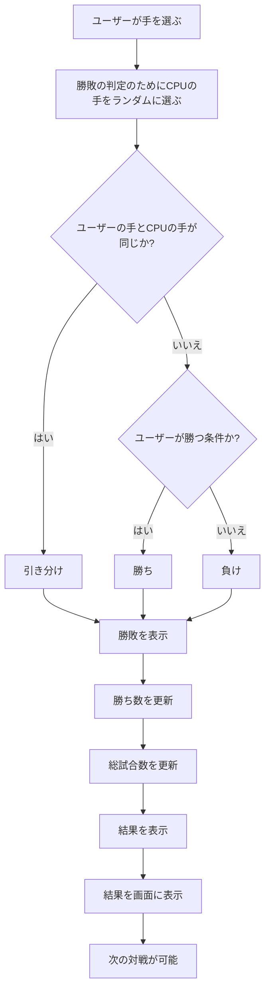
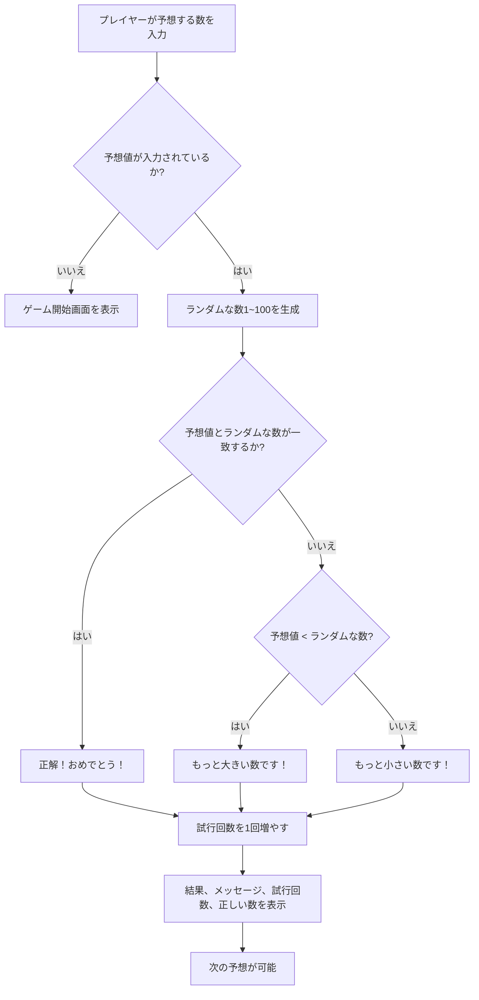
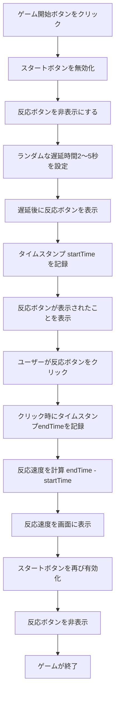

# webpro_06
## このプログラムについて
## ファイル一覧
ファイル名 | 説明
-|-
app5.js | プログラム本体
public/janken.html | じゃんけんの開始画面
views/janken.ejs | じゃんけんのテンプレートファイル
public/number-guess.html | 数当てゲームの開始画面
views/number-guess.ejs | 数当てゲームのテンプレート
views/timer-game,ejs | 反射神経測定の開始画面,テンプレートファイル

サーバーの起動方法
```javascript
node app5.js
```
をターミナルで入力する.
サーバーを開いた後にwebブラウザでそれぞれ
```javascript
localhost:8080/janken
localhost:8080/number-guess
localhost:8080/timer-game
```
を開く.
## プログラムの説明
じゃんけんのプログラムでは,ユーザーが選んだ手に対して,サーバー側でコンピュータがランダムに手を決定し,その勝敗を判定する.勝敗に応じて,勝ち数や試行回数を更新し,その結果を画面に表示するといったプログラムである.
数当てゲームのプログラムでは,ユーザーが入力した予想の数をもとに,コンピュータがランダムに生成した正解の数と比較する.予想が正解であれば,正解.小さければ,もっと大きい数です.大きければ,もっと小さい数です.という返答をする.ユーザーには試行回数も表示され,ゲームを繰り返すたびに試行回数がカウントされていくといったプログラムである.
反射神経測定のプログラムでは,ユーザーが反応ボタンをクリックした瞬間と,ボタンが表示された瞬間のタイムスタンプの差を計算して反応速度を求める.測定された反応時間は,秒単位で表示され,小数点以下3桁まで表示されるといったプログラムである.
## 各機能のプログラムのフローチャート
じゃんけんのフローチャート

数当てゲームのフローチャート

反射神経測定機能のフローチャート

